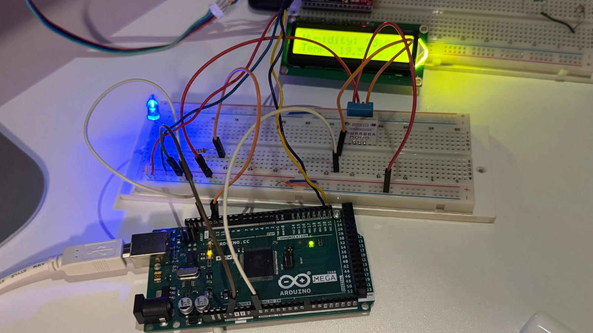
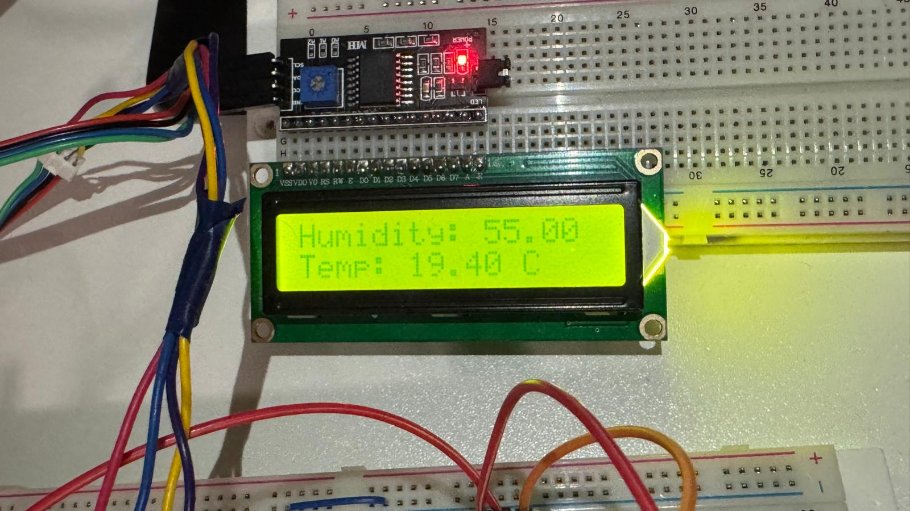

# 🌡️ Arduino DHT11 Temperature & Humidity Monitor with LCD

This project uses an **Arduino**, **DHT11 sensor**, and an **I2C LCD (20x4)** to measure and display temperature and humidity in real time. An LED indicator is also included to signal when a reading is taken.

---

## 📂 Project Structure
- src/               # Main source code (.ino, .cpp, .h)
- lib/               # Custom libraries (if any)
- docs/              # Documentation, notes, or schematics
- .gitignore         # Ignore rules for macOS + Arduino builds
- README.md          # Project overview

---

## ⚙️ Requirements
- **Arduino IDE** (or PlatformIO with VS Code)
- **Arduino board** (e.g., Uno, Mega, Nano, etc.)
- **DHT11 sensor** (or DHT22 with code change)
- **I2C 20x4 LCD module** (address `0x27` by default)
- **LED** + resistor for status indicator
- USB cable & drivers for programming

---

## 🚀 Setup & Usage
1. Clone this repository:
   ```bash
   git clone https://github.com/Razib91lightspeed/humidity_temparature_sensor.git
   ```
2. ```bash
   cd humidity_temparature_sensor
   ```
3. Open the .ino file inside the Arduino IDE.
4. Install the required libraries via Arduino IDE Library Manager if needed:
- DHT11 → Arduino pin A0
- LED → Arduino pin 12
- LCD → I2C (SDA, SCL pins)
5. Select your Arduino board + COM port in Tools → Board / Port.
6. Upload the code.
7. Open the Serial Monitor at 9600 baud to debug readings.

# 📊 Output
- The LCD screen shows current humidity and temperature.
- The LED blinks each time a new reading is taken.
- The Serial Monitor logs detailed debug info.



# 🛠️ Notes
- Change DHTTYPE in code to DHT22 if you use that sensor.
- Update the LCD I2C address (0x27) if yours is different.
- Measurements are updated every 7 seconds.
# 📜 License
- This project is for educational purposes. Free to use and modify.